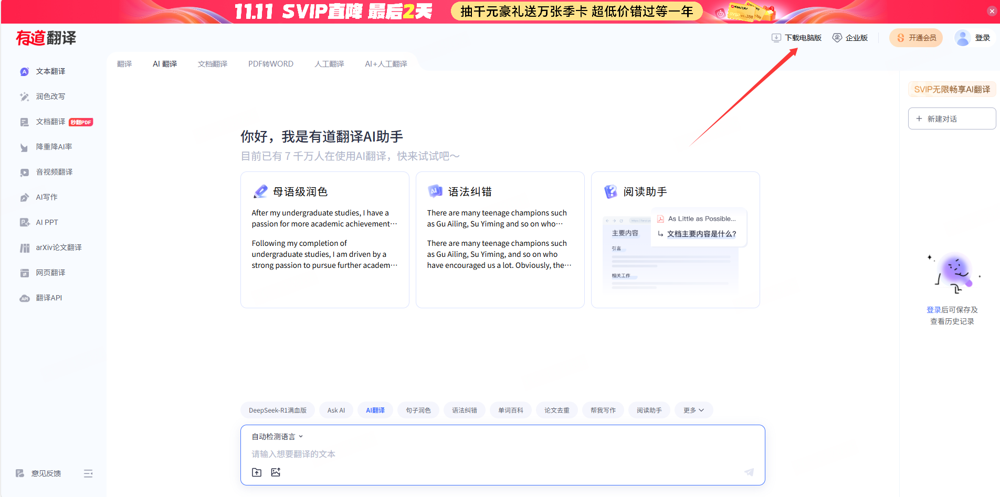
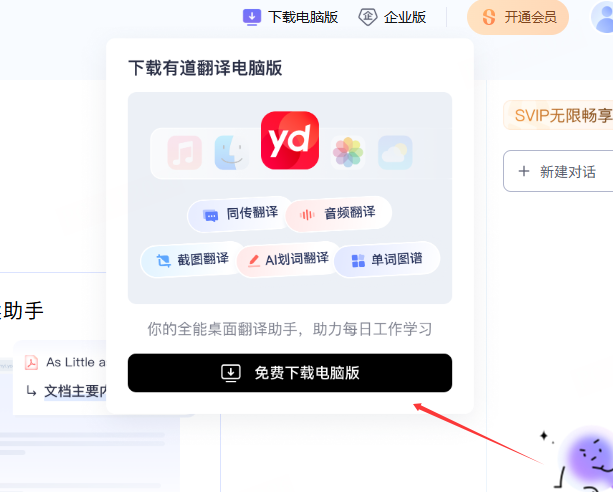
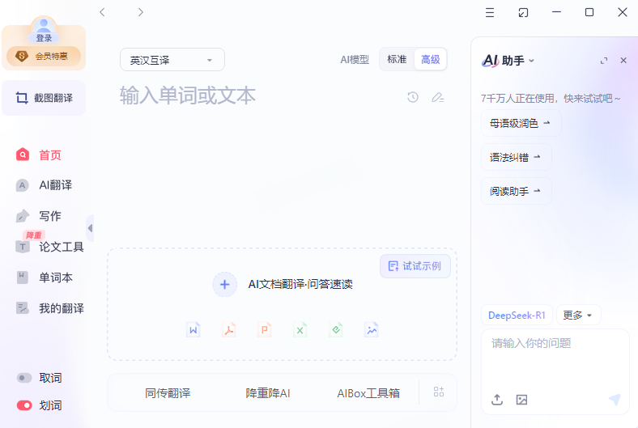
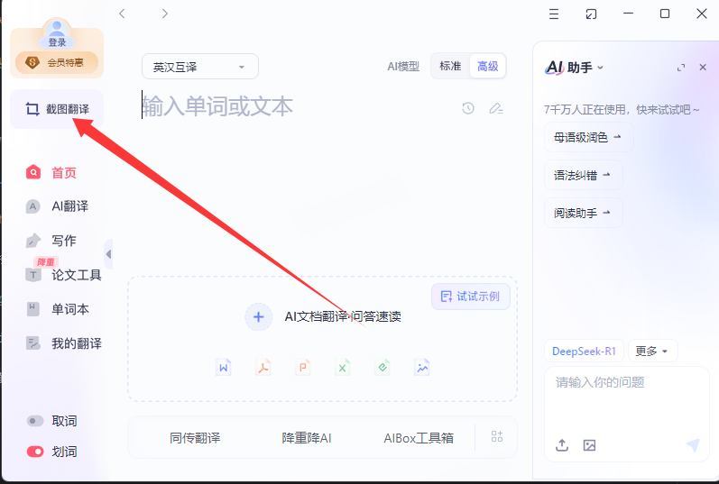
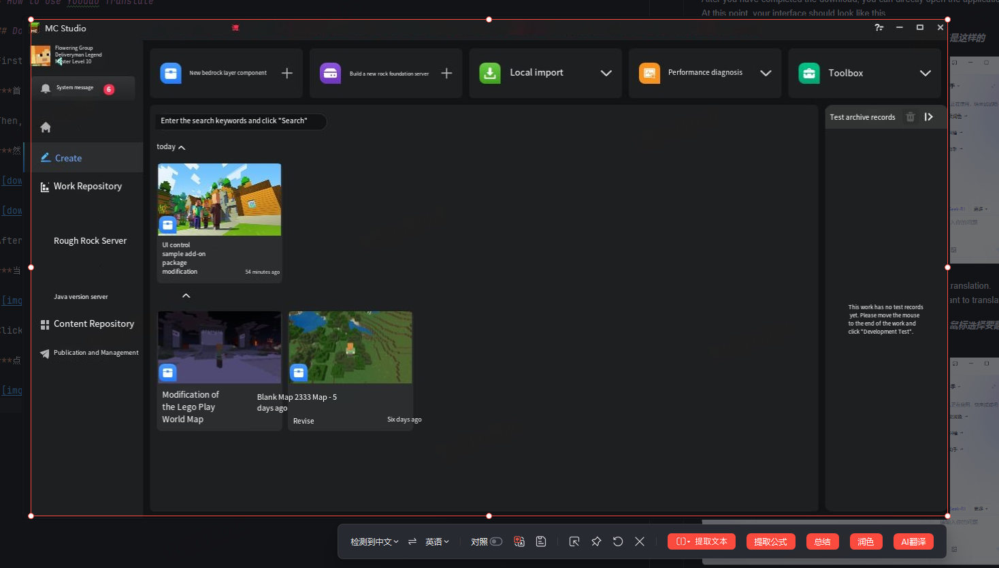
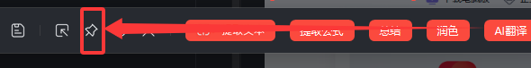

# How to use Youdao Translate

## Download Youdao Translate

First, You can go to Youdao translate official website https://fanyi.youdao.com/#/AITranslate

***首先，前往有道翻译的官网网站***

Then, Click on download Youdao translate

***然后，点击下载有道翻译***

After you have completed the download, you can directly open the application. At this point, your interface should look like this.

***当你下载完毕后，我们就可以直接打开应用，此时你的界面应该是这样的***

Click the button as shown in the picture to start the screenshot translation. After clicking, you can drag the mouse to select the area you want to translate.

***点击如图所示的按钮，开始进行截图翻译，点击以后你可以拖动鼠标选择要翻译的区域***

The translation effect is as follows

***翻译效果如下***

Although there may be some misunderstandings in the translation, it is completely sufficient for infrequently used functions

***虽然翻译可能会有一定的误解，但对于不常用的功能是完全足够的***

Tip: When using screenshot translation, you can use the "Pin" function to pin the picture to the desktop. This way, you can drag the picture beside the app for comparison

小贴士：在使用截图翻译时，你可以使用“钉住”的功能，将图片钉在桌面上，这样就可以将图片拖在应用旁边进行对比

