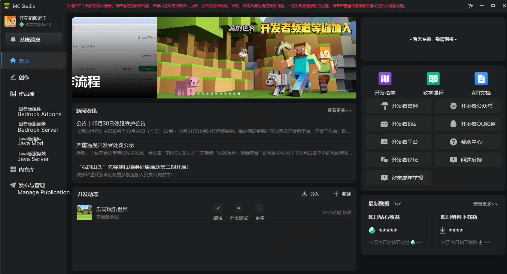
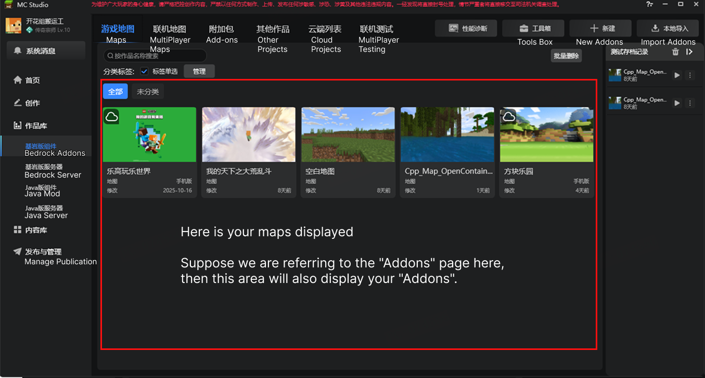
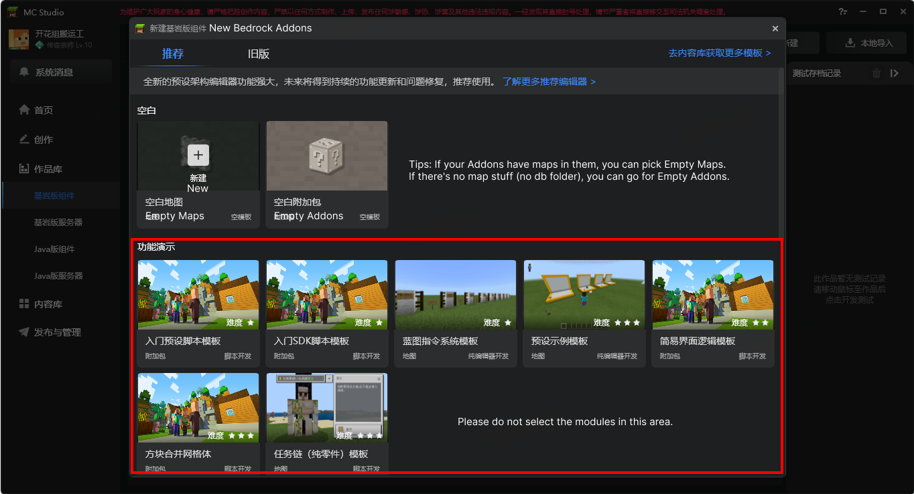
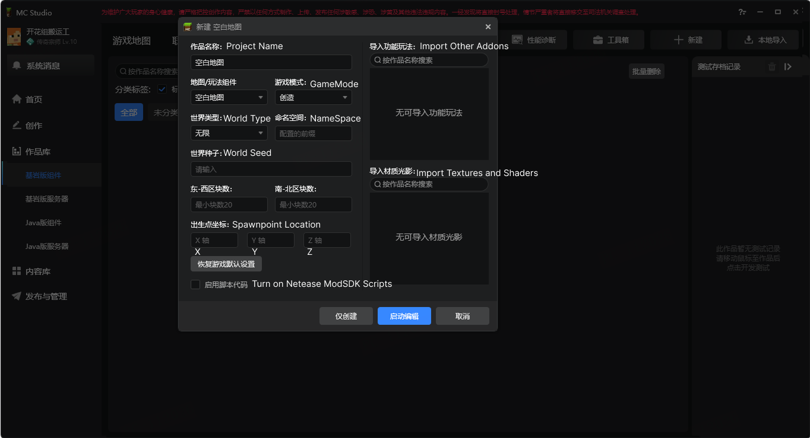
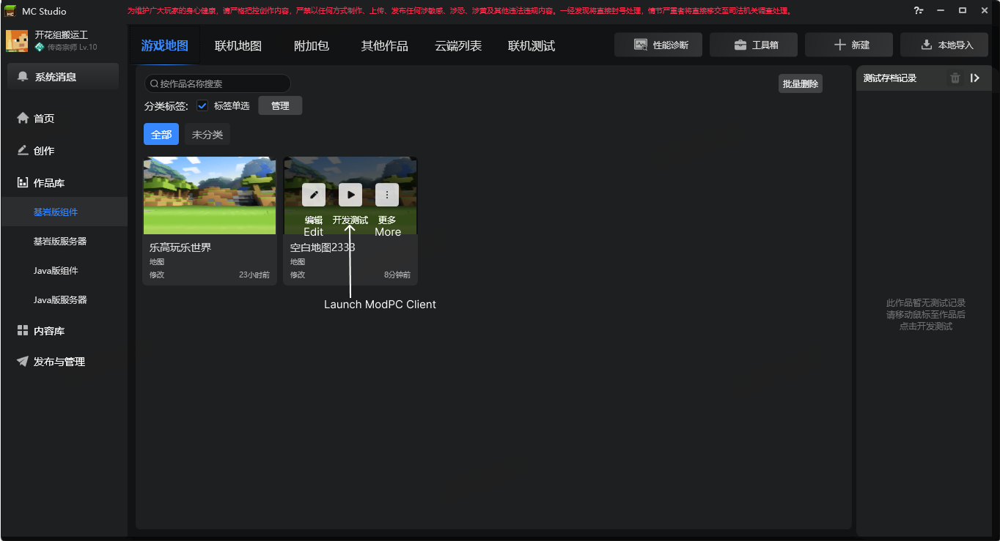
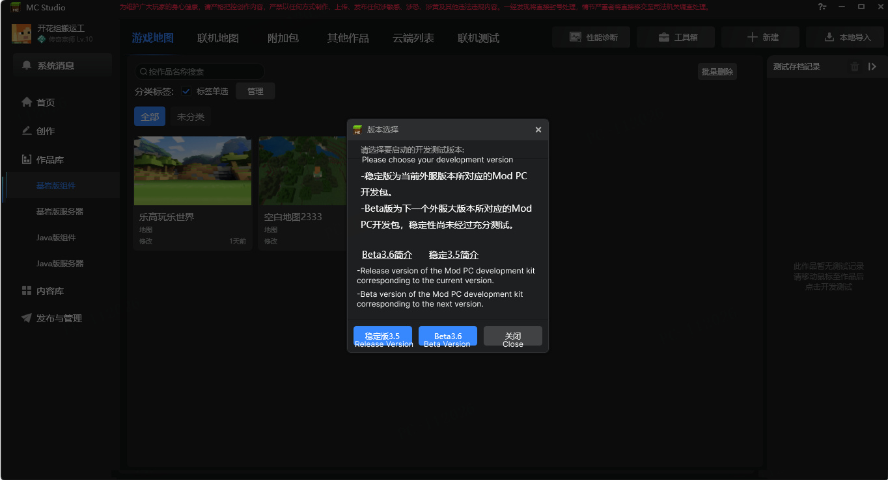

# MC Studio Usage

## MC Studio Homepage

Next, I will walk you through the MC Studio homepage. Some features are less relevant for international developers,so I will only focus on the functions that you will find useful.

***下面我将带您了解 MC Studio的首页，有些功能对于国际版开发者是不重要的，我只会介绍您用得上的功能***

Currently, the only feature you'll need is "Bedrock Addons" in the left sidebar.

***首先您用得上的功能目前仅只有一个， 就是左侧栏中的 Bedrock Addons***

"Bedrock Addons" is a dedicated section for managing Addons. It allows you to manage your Addons, including creating addons, launching the Json UI editor for addons, and quickly launching ModPC for testing.

***Bedrock Addons 是专门用来管理 Addons的一个功能分区，这个分区可以快速的管理您的Addons， 包括创建模组、打开模组Json UI编辑器、快速启动ModPC进行测试等***

Now, click on "Bedrock Addons".

***现在我们点击Bedrock Addons***

## Bedrock Addons Page

As shown in the diagram above, the Chinese Edition categorizes mods into "maps" and "add-ons." The distinction is based on whether the component directory contains a db file.

***根据上图我们可以知道中国版将模组分为地图和附加包，区分的方式是判断组件目录里是否包含db文件***

The area below is where your creations are displayed. When you create or import an add-on, 

***下方是展示你作品的区域，当你创建或者导入addons就会在下方显示***

Generally, we only need to use "New Addons" and "Import Addons" Let's first take a look at the "New Addons" page.

***一般来说，我们只需要用到新建作品和本地导入。我们先看看新建作品的页面***

When you click on "Empty Maps" or "Empty Addons," a configuration page will open.

***当你点击 Empty Maps 或者 Empty Addons 你将会打开一个配置页面***

Fill in the relevant addons information based on the image content, then click the "仅创建" button below.

***根据图片内容，填写相关addons信息，然后点击下面 仅创建 按钮***

When you create a new add-on, it will be displayed in the blank area below.

***当你创建好一个新的addons时，下面的空白区域就会显示***

At this point, click on "Launch ModPC Client" to open the ModPC development client.

***此时点击 Launch ModPC Client 你就会打开ModPC开发客户端***

According to the content of the image above, select the appropriate version.

***根据上述图片内容，选择合适的版本***

Then,You can then use the ModPC development client to preview the effects of your addons.

***然后你就可以通过ModPC开发客户端查看你的模组效果***